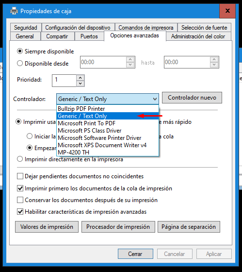

### Configuracion Cinexo
-------------

Para realizar la instalacion del sistema Cinexo se debe acceder a la carpeta ubicada en la siguiente ruta \\operaciones-rb\Cinexo

Instalar Java (Versión 1.8 para arriba, 32 o 64 bits según el sistema operativo que se esté usando)

Instalar Tray Server (Aplicación de Cinexo para manejo de impresora fiscal)

Instalar QZ Tray (Aplicación Open-Source para control de impresora térmica)

Al finalizar la instalación QZ Tray, tocar botón derecho en el icono verde que aparece al lado del reloj en la barra de tareas y marcar opción "Automatically Start" (Arranque automático)

Instalar Google Chrome

Instalar impresora térmica de entradas. En el caso de ser una Bematech MP4200-TH usar el instalador BemaSetup_MP4K_x64_v4.1.1.exe (64bits) o el LciSetup_LR3K_v4.1.1.exe (32bits)

En este paso hay que conectar la impresora térmica, encenderla y tocar “Aceptar”

El instalador de impresora completara los pasos y aparecerá una nueva impresora con el nombre “MP-4200 TH”. Probablemente por problemas de bloqueo de firewall de la red de Dinosaurio a los servidores de Microsoft, en este paso la impresora quede “instalando” y no se vea como impresora durante un largo rato (Se ve como “no especificado” dentro del panel de impresoras de Windows, ver paso 12 para llegar a ese panel) hay que esperar que figure correctamente como impresora.

Cambiar el nombre de la impresora térmica de entradas a "caja" y seleccionar driver a “Generic/Text Only” (Los pasos pueden variar según la versión de Windows 10)

*  Abrir panel de control clásico (Win+R, escribir control + enter)
*  En el buscador arriba a la derecha escribir “impresora”
*  Click en “Ver dispositivos e impresoras”
*  Hacer doble click en la impresora recién instalada

Cuando se abra la cola de impresión, tocar impresora -> propiedades

Cambiar nombre a “Caja”

Seleccionar driver “Generic/Text Only” en pestaña “opciones avanzadas”

Cerrar sesión dinoadmin e iniciar usuario nuevo con el que se va a facturar (Usuario no administrador)

Copiar el "Tray Server.lnk" (Acceso directo de Tray Server que se crea automáticamente en el escritorio tras instalación) a c$\Users\[USUARIO QUE SE VA A UTILIZAR PARA FACTURAR]\AppData\Roaming\Microsoft\Windows\Start Menu\Programs\Startup\ para que se ejecute automáticamente en el arranque

Crear acceso directo en el escritorio a QZ TRay (c$\Program Files\QZ Tray\qz-tray.exe)

Configurar Google Chrome como navegador por defecto en Windows 10 (Puede abrirse aplicación y pedirá solo configurarse a sí mismo como navegador por defecto)

Crear acceso directo a cola de impresión de impresora térmica de entradas en escritorio

Detectar el número de puerto COM de impresora fiscal en administrador de dispositivos

Abrir preferencias de Tray Server y seleccionar modelo de impresora fiscal y puerto COM en el que se encuentra (Click derecho en icono al lado de reloj)

Crear accesos directos en escritorio para frontend y backend de sistema Candy y Boletería (Cambiar a IP de servidor local de su sucursal). URLS:

> Cambiar xx por el octeto de la sucursal

**Frontend Candy**
http://172.xx.2.80/5.0/Candy/front/candy 

**Backend Candy**

http://172.xx.2.80/5.0/Candy/back/candy

**Boleteria**

http://172.xx.2.80/5.0/Boleteria/admin/app/Login.php

Configurar Autogon con el usuario creado para las cajas
**Aplicacion** : Autologon.exe

Va a solicitar aceptar los términos y condiciones la primera vez que se ejecuta, dar permisos de administrador, click en “Agree” y completar los datos del usuario creado para caja (Usuario, nombre de dominio “DINOSAURIO” y clave.

