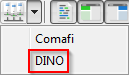
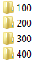

------------------
# Envio Cobros

-----------------

Ingresamos a la carpeta 

Luego a 

Y luego a 

Una vez aqui ejecutamos

Nos debería mover los Txt a la carpeta 2020
Los mismos quedaran fuera de la carpeta del mes 
Una vez aquí vamos al Filezilla y nos conectamos

Pasamos cada archivo txt a la cuenta correspondiente

Una vez realizado, movemos los txt de la carpeta de expensas al mes correspondiente y con esto quedaria realizado el procedimiento de envio de cobros.

! Si encuentras algun error o procedimiento desactualizado, avisanos asi lo solucionamos.