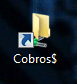

------------------
# Envio Cobros

-----------------

1. Ingresamos a la carpeta 

2. Luego a 

3. Y luego a 

4. Una vez aqui ejecutamos

5. Nos debería mover los Txt a la carpeta 2020
Los mismos quedaran fuera de la carpeta del mes 
Una vez aquí vamos al Filezilla y nos conectamos

6. Pasamos cada archivo txt a la cuenta correspondiente

7. Una vez realizado, movemos los txt de la carpeta de expensas al mes correspondiente y con esto quedaria realizado el procedimiento de envio de cobros.