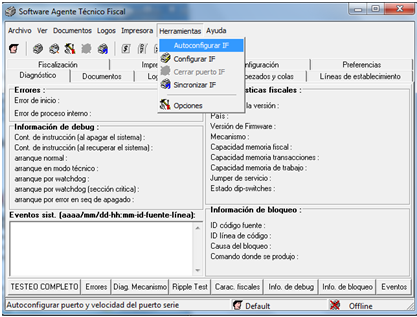
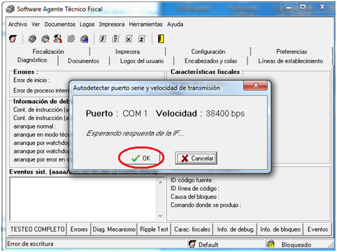
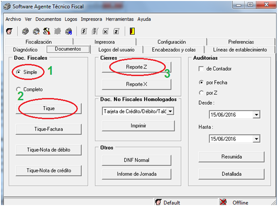
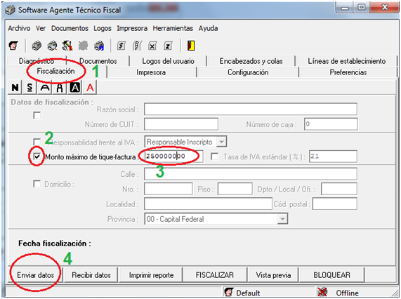

### Elevar limite fiscales
----------
[Descargar Programa](Epson_tope_2millones.rar)

Una vez conectada la impresora fiscal en la pc, abris el programa de Fiscal Epson y te va a aparecer la siguiente interfaz:

---------
Seleccionas Herramientas, Autoconfigurar IF tal como se ve en la imagen, lo que haces con esto es buscar automáticamente la Fiscal y configurarla en el puerto que corresponda.
Una vez configurada te aparece la siguiente ventana donde debes hacer clik en OK.

---------
A partir de esto la fiscal ya se encuentra conectada y configurada.

### TIRAR TIQUETS DE $0.01 Y REPORTES Z
Para tirar un ticket de $0.01 abris la pestaña documentos y seleccionas el ítem Simple como te muestra el ítem 1, luego seleccionas el cuadro Ticket para que salga el mismo.
EN el caso de la Z, es el paso 3 de la siguiente imagen siempre y cuando tengas un ticket abierto.

---------

---------

### AUMENTAR EL LIMITE DE LA FISCAL
Esto se hace en la pestaña Fiscalizacion (siguiente imagen), destildas todo tal como se muestra en la misma para solo transmitir el valor a ingresar y tene en cuenta que tenes que calcular  2 ceros mas del valor que vas a meterle a la fiscal, es decir para transmitir como en este caso 2.500.000 vas a tener que escribir en el textbox el valor de 250000000, esos últimos dos son los centavos.  Deberían tener separador decimal.

! Si encuentras algun error o procedimiento desactualizado, avisanos asi lo solucionamos.

