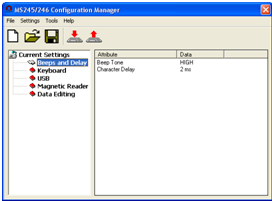
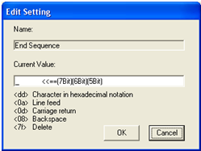

### Configurar lector de banda Unitech MS246

-----------

[Descargar Programa](MS245_246_setup.rar)

-----------

* Instalamos el setup  
* Una vez instalado abrimos el programa

* Vamos a Magnetic Reader y solo cambiamos el ultimo valor que es End Secuence, cambiamos los %%% por _

Para finalizar vamos a   y esperamos a que encuentre el lector, despues le damos download, el lector hara un pitido y queda configurado
