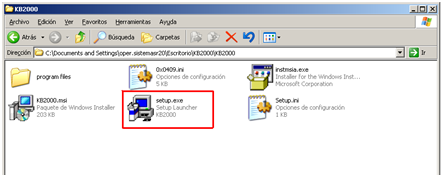
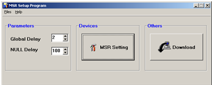
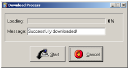

### Configurar lector de banda Dynapos

-----------

[Descargar programa](KB2000.zip)

-----------

* Se debe instalar el programa contenido en el rar 
* Instalamos el Setup.exe 

* Abrimos el programa, vamos a MSR setting

* Ponemos los siguientes valores

![Ver imagen(3.png)

Damos OK y volvemos a la primera pantalla, vamos a Download, damos start

Y queda listo para usar leyendo solo la primera banda de la siguiente manera
%B999997000000001234_

! Si encuentras algun error o procedimiento desactualizado, avisanos asi lo solucionamos.
